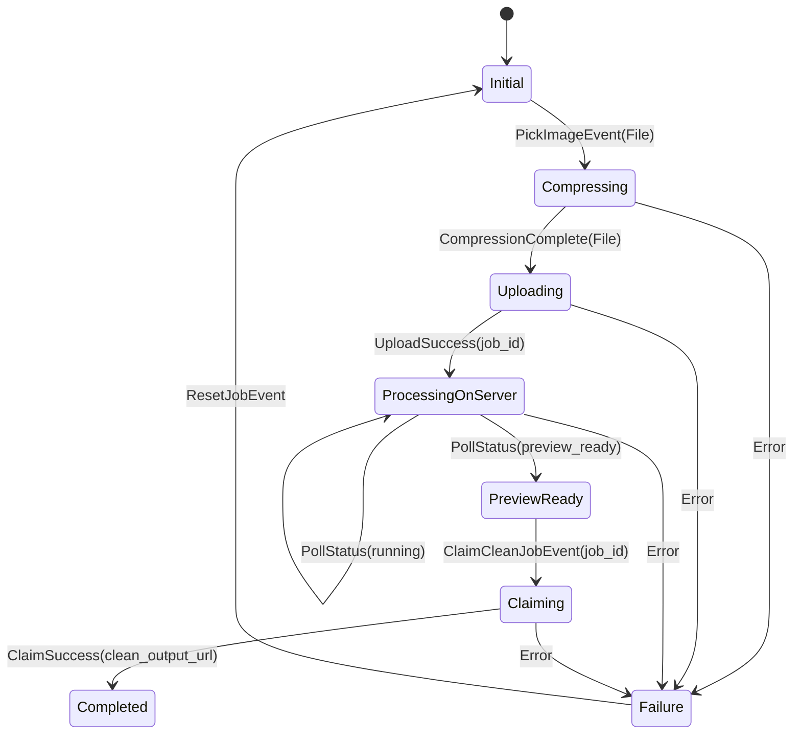

# 04. State Management & Routing Architecture

## 1. State Management: Flutter BLoC & Cubit Standard

The **RemoveIt** mobile application relies on **BLoC (Business Logic Component) and Cubit** from `package:flutter_bloc` as its designated state management framework.

### Why BLoC for Consumer AI Photo Utilities?
1. **Unidirectional Data Flow**: State is strictly driven by explicit, immutable events (`PickImageEvent`, `UploadProgressEvent`, `PollStatusEvent`, `ClaimCleanJobEvent`).
2. **Auditability & Traceability**: Critical operations (e.g. quota deduction, AdMob SSV handshake, RevenueCat IAP entitlement) are captured by discrete events logged via `BlocObserver`.
3. **Resilience to Network Drops**: Long-polling and asynchronous worker processing states are cleanly modeled without race conditions.
4. **Isolate Decoupling**: Offloads heavy tasks to worker isolates while emitting progress events cleanly to the UI.

---

## 2. BLoC vs. Cubit Usage Boundaries

To prevent over-engineering while enforcing discipline:

| Pattern | When to Use | Examples in RemoveIt |
| :--- | :--- | :--- |
| **BLoC** (Event-Driven) | Complex, asynchronous, multi-step operations requiring audit trails, retries, or server sync. | `JobProcessingBloc`, `AuthBloc`, `QuotaBloc`, `MonetizationBloc`, `HistoryBloc` |
| **Cubit** (Direct Mutation) | Synchronous or simple UI state machines local to a screen. | `StudioCanvasCubit` (slider position, backdrop color), `ThemeCubit` (dark/light) |

---

## 3. Core State Machines

### 3.1 `JobProcessingBloc` (The AI Engine Machine)



#### States Definition:
```dart
// lib/features/image_processing/presentation/bloc/job_processing_state.dart
import 'package:equatable/equatable.dart';
import 'package:removeit_app/features/image_processing/domain/entities/job_entity.dart';

abstract class JobProcessingState extends Equatable {
  const JobProcessingState();
  @override
  List<Object?> get props => [];
}

class JobInitialState extends JobProcessingState {
  const JobInitialState();
}

class JobCompressingState extends JobProcessingState {
  const JobCompressingState();
}

class JobUploadingState extends JobProcessingState {
  final double progress; // 0.0 to 1.0
  const JobUploadingState(this.progress);
  @override
  List<Object?> get props => [progress];
}

class JobProcessingOnServerState extends JobProcessingState {
  final String jobId;
  final int estimatedSecondsRemaining;
  const JobProcessingOnServerState({required this.jobId, required this.estimatedSecondsRemaining});
  @override
  List<Object?> get props => [jobId, estimatedSecondsRemaining];
}

class JobPreviewReadyState extends JobProcessingState {
  final JobEntity job;
  const JobPreviewReadyState(this.job);
  @override
  List<Object?> get props => [job];
}

class JobClaimingState extends JobProcessingState {
  final String jobId;
  const JobClaimingState(this.jobId);
  @override
  List<Object?> get props => [jobId];
}

class JobCompletedState extends JobProcessingState {
  final JobEntity job;
  const JobCompletedState(this.job);
  @override
  List<Object?> get props => [job];
}

class JobErrorState extends JobProcessingState {
  final String message;
  final String? errorCode;
  const JobErrorState({required this.message, this.errorCode});
  @override
  List<Object?> get props => [message, errorCode];
}
```

---

### 3.2 `QuotaBloc` (Atomic Quota & Ad Bonus Synchronization)
The Quota BLoC guarantees that the app's quota pill and limits are updated in real-time without requiring a full app restart.

- **Events:**
  - `FetchQuotaEvent`: Loads current daily quota from `GET /api/v1/quota/`.
  - `QuotaDecrementedEvent`: Emitted automatically when a job claim succeeds.
  - `AdBonusRewardedEvent`: Emitted when Google AdMob SSV verifies a rewarded ad session.
- **States:**
  - `QuotaLoadingState`
  - `QuotaLoadedState(UserQuotaEntity quota)`
  - `QuotaExhaustedState(UserQuotaEntity quota, bool canWatchBonusAd)`
  - `QuotaErrorState(String message)`

---

## 4. Declarative Routing with `GoRouter`

Navigation is declared using `GoRouter`, enabling clean URL paths, stateful nested navigation for bottom tabs, and deep-linking:

```dart
// lib/core/router/app_router.dart
import 'package:flutter/material.dart';
import 'package:go_router/go_router.dart';
import 'package:removeit_app/core/router/route_names.dart';
import 'package:removeit_app/features/image_processing/presentation/screens/home_screen.dart';
import 'package:removeit_app/features/studio_canvas/presentation/screens/studio_canvas_screen.dart';
import 'package:removeit_app/features/history/presentation/screens/history_screen.dart';
import 'package:removeit_app/features/settings/presentation/screens/settings_screen.dart';
import 'package:removeit_app/features/monetization/presentation/screens/pro_paywall_screen.dart';

final GlobalKey<NavigatorState> rootNavigatorKey = GlobalKey<NavigatorState>();

class AppRouter {
  static final GoRouter router = GoRouter(
    navigatorKey: rootNavigatorKey,
    initialLocation: RouteNames.home,
    routes: [
      StatefulShellRoute.indexedStack(
        builder: (context, state, navigationShell) {
          return AppBottomNavScaffold(navigationShell: navigationShell);
        },
        branches: [
          StatefulShellBranch(
            routes: [
              GoRoute(
                path: RouteNames.home,
                builder: (context, state) => const HomeScreen(),
              ),
            ],
          ),
          StatefulShellBranch(
            routes: [
              GoRoute(
                path: RouteNames.history,
                builder: (context, state) => const HistoryScreen(),
              ),
            ],
          ),
          StatefulShellBranch(
            routes: [
              GoRoute(
                path: RouteNames.settings,
                builder: (context, state) => const SettingsScreen(),
              ),
            ],
          ),
        ],
      ),
      GoRoute(
        path: RouteNames.canvas,
        parentNavigatorKey: rootNavigatorKey,
        builder: (context, state) {
          final jobId = state.uri.queryParameters['jobId'] ?? '';
          return StudioCanvasScreen(jobId: jobId);
        },
      ),
      GoRoute(
        path: RouteNames.paywall,
        parentNavigatorKey: rootNavigatorKey,
        builder: (context, state) => const ProPaywallScreen(),
      ),
    ],
  );
}
```

---

## 5. Navigation Guards & Route Interception

To guarantee data integrity and prevent broken UI states:
1. **Canvas Guard:** If a user navigates to `/canvas` without an active job entity in `JobProcessingBloc` or a valid `jobId` parameter, the router automatically redirects back to `/home`.
2. **Maintenance Mode Guard:** If `GET /api/v1/flags/` indicates `maintenance_mode = true`, all routes redirect to a dedicated `MaintenanceOverlayScreen`.
3. **App Upgrade Guard:** If the backend flags `min_app_version` higher than the installed build, an unskippable update prompt is displayed.
