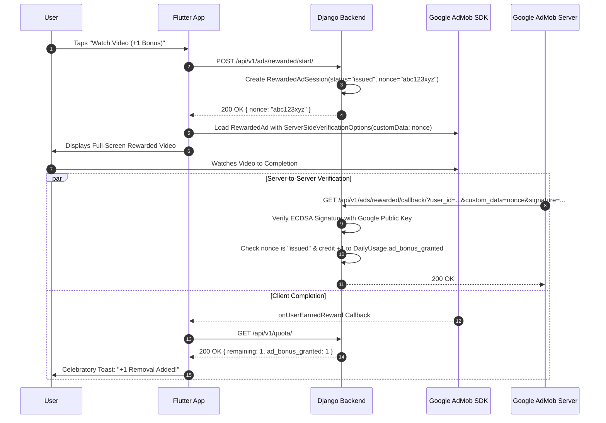

# 08. Monetization: AdMob SSV & RevenueCat In-App Purchases

RemoveIt implements a hybrid consumer monetization engine balancing ad revenue from free casual users with high-margin subscriptions from pro power users.

---

## 1. Unified Entitlement & Monetization Architecture

```
┌─────────────────────────────────────────────────────────────────────────────┐
│                            Monetization Engine                              │
└───────────────────────┬─────────────────────────────┬───────────────────────┘
                        │                             │
          Free Tier Users (Ads & Quota)      Pro Subscribers (IAP)
                        │                             │
                        ▼                             ▼
        ┌───────────────────────────────┐ ┌───────────────────────────────────┐
        │       Google AdMob SDK        │ │         RevenueCat SDK            │
        │ - Adaptive Banners            │ │  (purchases_flutter)              │
        │ - Interstitial Ads (Capped)   │ │ - Google Play Billing             │
        │ - Rewarded Video (ECDSA SSV)  │ │ - Apple StoreKit                  │
        └───────────────┬───────────────┘ └─────────────────┬─────────────────┘
                        │                                   │
                        │ SSV Nonce                         │ Webhooks
                        ▼                                   ▼
        ┌─────────────────────────────────────────────────────────────────────┐
        │                   Django Centralized Entitlement                    │
        │  - Validates AdMob ECDSA signature & credits +1 bonus               │
        │  - Resolves active plan (free vs pro_monthly/pro_yearly)            │
        └─────────────────────────────────────────────────────────────────────┘
```

---

## 2. Dynamic Ad Mediation Configuration (`/api/v1/ads/config/`)

To prevent hardcoding AdMob unit IDs into the Flutter client binary (which requires app store re-submissions to modify), the app fetches its configuration dynamically on boot:

```json
GET /api/v1/ads/config/?platform=android
{
  "success": true,
  "data": {
    "banner_enabled": true,
    "rewarded_enabled": true,
    "interstitial_enabled": true,
    "placements": {
      "home_banner": { "unit_id": "ca-app-pub-3940256099942544/6300978111", "network": "admob" },
      "reward_bonus": { "unit_id": "ca-app-pub-3940256099942544/5224354917", "network": "admob" },
      "export_interstitial": { "unit_id": "ca-app-pub-3940256099942544/1033173712", "network": "admob" }
    }
  }
}
```

---

## 3. Cryptographic AdMob Server-Side Verification (SSV) Flow

Client-side ad callbacks can be spoofed on rooted devices using proxy tools or modified APKs. RemoveIt enforces **Server-Side Verification (SSV)**:



### Flutter SSV AdMob Implementation
```dart
// lib/features/monetization/data/datasources/admob_data_source.dart
import 'package:google_mobile_ads/google_mobile_ads.dart';
import 'package:removeit_app/core/network/api_client.dart';

class AdMobDataSource {
  final ApiClient apiClient;
  RewardedAd? _rewardedAd;

  AdMobDataSource(this.apiClient);

  Future<void> showRewardedBonusAd({
    required String adUnitId,
    required String userId,
    required Function onRewardVerified,
    required Function(String error) onFailure,
  }) async {
    // 1. Request cryptographic nonce from Django backend
    final sessionResponse = await apiClient.post('/api/v1/ads/rewarded/start/');
    final nonce = sessionResponse.data['data']['nonce'] as String;

    // 2. Load AdMob Rewarded Ad
    await RewardedAd.load(
      adUnitId: adUnitId,
      request: const AdRequest(),
      rewardedAdLoadCallback: RewardedAdLoadCallback(
        onAdLoaded: (ad) {
          _rewardedAd = ad;
          // Attach Server-Side Verification options
          _rewardedAd!.setServerSideOptions(
            ServerSideVerificationOptions(
              userId: userId,
              customData: nonce,
            ),
          );

          // 3. Display Ad
          _rewardedAd!.show(
            onUserEarnedReward: (AdWithoutView adView, RewardItem reward) async {
              // Poll backend to confirm SSV signature verification
              await Future.delayed(const Duration(milliseconds: 1200));
              onRewardVerified();
            },
          );
        },
        onAdFailedToLoad: (error) {
          onFailure(error.message);
        },
      ),
    );
  }
}
```

---

## 4. RevenueCat In-App Purchase Architecture (`purchases_flutter`)

RemoveIt uses **RevenueCat** to abstract Google Play Billing and Apple StoreKit:

### 4.1 Configuration & Bootstrapping
```dart
// lib/features/monetization/data/datasources/revenuecat_data_source.dart
import 'dart:io';
import 'package:purchases_flutter/purchases_flutter.dart';

class RevenueCatDataSource {
  static const String _apiKeyAndroid = 'goog_sample_key_android';
  static const String _apiKeyIOS = 'appl_sample_key_ios';
  static const String entitlementId = 'pro_access';

  static Future<void> initialize({required String appUserId}) async {
    final apiKey = Platform.isAndroid ? _apiKeyAndroid : _apiKeyIOS;
    final configuration = PurchasesConfiguration(apiKey)..appUserID = appUserId;
    await Purchases.configure(configuration);
  }

  static Future<bool> isUserPro() async {
    final customerInfo = await Purchases.getCustomerInfo();
    return customerInfo.entitlements.all[entitlementId]?.isActive ?? false;
  }

  static Future<CustomerInfo> purchasePackage(Package package) async {
    return await Purchases.purchasePackage(package);
  }

  static Future<CustomerInfo> restorePurchases() async {
    return await Purchases.restorePurchases();
  }
}
```

---

## 5. Paywall Design & Apple App Store Compliance

To comply with App Store Review Guideline 3.1.2 (Subscriptions):
1. **Clear Pricing Disclosure:** Display exact monthly / annual subscription cost, currency, and renewal terms prominently.
2. **Restore Purchases:** Place a visible **"Restore Purchases"** button in the header and footer of the paywall screen.
3. **Legal Links:** Include direct clickable links to **"Terms of Service"** and **"Privacy Policy"** within the paywall viewport.
4. **No Misleading Promises:** Pro tier clearly highlights:
   - High-Resolution Uncompressed Exports (4K / Native Sensor)
   - Unlimited / High Daily Removals (200/day fair-use)
   - Batch Processing (Upload up to 20 photos simultaneously)
   - Ad-Free Workspace (No full-screen or rewarded ads)
