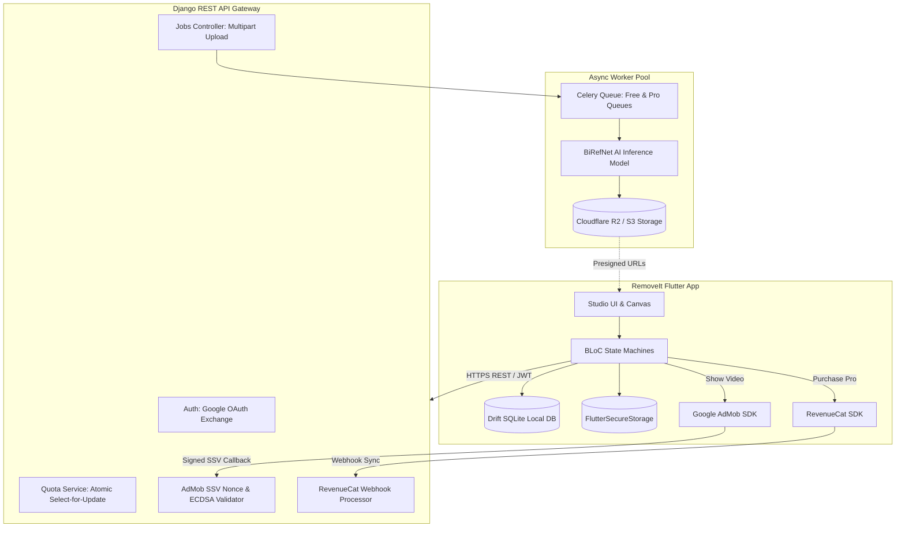

# RemoveIt Mobile App: Master Technical Plan & Delivery Roadmap

Version 1.0 | Target Platforms: iOS & Android | Framework: Flutter 3.38+ / Dart 3.10+ | Architecture: Feature-First Clean Architecture + BLoC

---

## 1. Executive Summary & Product Mission

**RemoveIt** is a consumer AI utility and creative photo editing mobile application. It empowers photographers, e-commerce merchants, content creators, and everyday consumers to isolate subjects, remove backgrounds, replace backdrops with solid studio colors, and export high-resolution assets with single-tap precision.

### 1.1 Core Business Model & Limits
RemoveIt operates on a balanced hybrid freemium monetization model driven dynamically by the Django backend (`apps/siteconfig` and `apps/billing`):

| Feature / Rule | Free Tier | Pro Tier (Subscription / Lifetime) | Configurable in Backend Admin |
| :--- | :--- | :--- | :--- |
| **Base Daily Removals** | 1 per day | Unlimited / Fair-use (e.g. 200/day) | Yes (`Plan.daily_limit`) |
| **Bonus Removals via Rewarded Ad** | +1 per completed video | Not applicable (unlimited) | Yes (`Plan.max_ad_bonus`) |
| **Max Bonus Ads Per Day** | 2 ads (+2 bonus removals) | Not applicable | Yes (`SiteSetting`) |
| **Export Resolution** | Clamped to **1080p** (1920px max edge) | **100% Native Sensor** (e.g. 4032x3024 / 48MP) | Yes (`Plan.max_output_resolution`) |
| **Banner Ads** | Non-intrusive bottom banner | Optional (Configurable per plan) | Yes (`Plan.banner_ads_enabled`) |
| **Rewarded & Full-Screen Ads** | Shown for bonus unlocks & export | **Zero interruptions** | Yes (`Plan.other_ads_enabled`) |
| **Bulk Processing** | Single photo only | Up to 20 photos simultaneously | Yes (`Plan.max_batch_size`) |
| **Cloud History Retention** | 7 days | 30 days | Yes (`Plan.history_retention_days`) |

---

## 2. Technology Stack & Client Architecture

```
┌─────────────────────────────────────────────────────────────────────────────┐
│                       RemoveIt Flutter Application                          │
├─────────────────────────────────────────────────────────────────────────────┤
│ Core:                Flutter 3.38+, Dart 3.10+, Material 3                  │
│ Architecture:        Feature-First Clean Architecture (Domain / Data / UI) │
│ State Management:    Flutter BLoC & Cubit (`flutter_bloc ^8.1.6`)           │
│ Navigation:          GoRouter (`go_router ^14.8.1`) with StatefulShellRoute │
│ Networking:          Dio (`dio ^5.8.0+1`) with Queued Refresh Interceptors │
│ Local Persistence:   Drift (`drift ^2.24.2`) SQLite + FlutterSecureStorage │
│ Hardware / Media:    ImagePicker, Dart Compute Isolates, Gal Gallery Saver  │
│ Monetization:        Google Mobile Ads (AdMob) + RevenueCat (StoreKit/IAP)  │
│ Design Tokens:       Studio Obsidian Dark (`#090C10`), Outfit & Inter Fonts │
└─────────────────────────────────────────────────────────────────────────────┘
```

---

## 3. End-to-End System Integration Architecture



---

## 4. Complete Master Documentation Suite

The complete architectural specification for RemoveIt has been organized into dedicated blueprint documents in `docs/`:

1. [**`README.md`**](file:///Users/hijazc/hijazc/removeit_app/docs/README.md) — Master Architectural Blueprint & 10-Step Feature Implementation Workflow.
2. [**`01_ARCHITECTURE_AND_PATTERNS.md`**](file:///Users/hijazc/hijazc/removeit_app/docs/01_ARCHITECTURE_AND_PATTERNS.md) — Feature-First Clean Architecture, Layer Rules, Inversion of Control, and Isolate Preprocessing.
3. [**`02_FOLDER_STRUCTURE_AND_CONVENTIONS.md`**](file:///Users/hijazc/hijazc/removeit_app/docs/02_FOLDER_STRUCTURE_AND_CONVENTIONS.md) — Complete `lib/` directory tree, naming conventions, and barrel exports.
4. [**`03_CONSUMER_MOBILE_UI_UX_AND_DESIGN_SYSTEM.md`**](file:///Users/hijazc/hijazc/removeit_app/docs/03_CONSUMER_MOBILE_UI_UX_AND_DESIGN_SYSTEM.md) — Studio Dark aesthetic, Thumb-zone ergonomics, Haptic feedback, and Responsive breakpoints.
5. [**`04_STATE_MANAGEMENT_AND_ROUTING.md`**](file:///Users/hijazc/hijazc/removeit_app/docs/04_STATE_MANAGEMENT_AND_ROUTING.md) — BLoC state machines, GoRouter declarations, and route guards.
6. [**`05_AUTH_GUEST_MODE_AND_SECURITY.md`**](file:///Users/hijazc/hijazc/removeit_app/docs/05_AUTH_GUEST_MODE_AND_SECURITY.md) — Guest-First onboarding, Google/Apple Sign-In, and Queued Silent Token Refresh.
7. [**`06_NETWORKING_API_AND_OFFLINE_SYNC.md`**](file:///Users/hijazc/hijazc/removeit_app/docs/06_NETWORKING_API_AND_OFFLINE_SYNC.md) — Dio client, multipart upload progress, polling, and error transformation.
8. [**`07_IMAGE_PROCESSING_CANVAS_AND_STUDIO_ENGINE.md`**](file:///Users/hijazc/hijazc/removeit_app/docs/07_IMAGE_PROCESSING_CANVAS_AND_STUDIO_ENGINE.md) — Interactive Split-View Comparison Slider, pan/zoom, dynamic backdrops, and export pipeline.
9. [**`08_MONETIZATION_ADMOB_SSV_AND_REVENUECAT.md`**](file:///Users/hijazc/hijazc/removeit_app/docs/08_MONETIZATION_ADMOB_SSV_AND_REVENUECAT.md) — Dynamic ad mediation, AdMob SSV handshake, and RevenueCat in-app purchase paywalls.
10. [**`09_LOCAL_STORAGE_HISTORY_AND_CACHE.md`**](file:///Users/hijazc/hijazc/removeit_app/docs/09_LOCAL_STORAGE_HISTORY_AND_CACHE.md) — Drift SQLite local database, cloud sync, and disk cache eviction.
11. [**`10_COMMON_WIDGET_CATALOG.md`**](file:///Users/hijazc/hijazc/removeit_app/docs/10_COMMON_WIDGET_CATALOG.md) — Centralized reusable UI catalog (`StudioScaffold`, `GlowButton`, `ComparisonSlider`, `QuotaPillBadge`).
12. [**`11_THEME_TOKENS_AND_CONTEXT_SYSTEM.md`**](file:///Users/hijazc/hijazc/removeit_app/docs/11_THEME_TOKENS_AND_CONTEXT_SYSTEM.md) — StudioThemeExtension, color tokens, and BuildContext extensions.
13. [**`12_LOCALIZATION_AND_INTERNATIONALIZATION.md`**](file:///Users/hijazc/hijazc/removeit_app/docs/12_LOCALIZATION_AND_INTERNATIONALIZATION.md) — Multi-language arb files, RTL layout support, and currency formatting.
14. [**`13_DEPENDENCY_INJECTION_AND_FLAVORS.md`**](file:///Users/hijazc/hijazc/removeit_app/docs/13_DEPENDENCY_INJECTION_AND_FLAVORS.md) — `get_it` registration tiers and `dev`/`staging`/`prod` flavor configurations.
15. [**`14_TESTING_CI_CD_AND_STORE_DEPLOYMENT.md`**](file:///Users/hijazc/hijazc/removeit_app/docs/14_TESTING_CI_CD_AND_STORE_DEPLOYMENT.md) — BLoC unit testing, GitHub Actions CI, Fastlane deployment, and store compliance.
16. [**`15_RECOMMENDED_PACKAGES_AND_TOOLING.md`**](file:///Users/hijazc/hijazc/removeit_app/docs/15_RECOMMENDED_PACKAGES_AND_TOOLING.md) — Vetted `pubspec.yaml`, analysis options, and lint rules.
17. [**`ROADMAP.md`**](file:///Users/hijazc/hijazc/removeit_app/docs/ROADMAP.md) — Phased Implementation Roadmap with full acceptance criteria.
18. [**`ROADMAP_PROGRESS.md`**](file:///Users/hijazc/hijazc/removeit_app/docs/ROADMAP_PROGRESS.md) — Implementation Status Tracker with component checklists and prerequisite gates.

---

## 5. Phased Delivery Roadmap & Sprint Milestones

```
[Phase 0: Foundations] ──► [Phase 1: Core Processing & Studio] ──► [Phase 2: Quota & AdMob SSV]
                                                                             │
[Phase 5: Store Launch] ◄── [Phase 4: History & Polish] ◄── [Phase 3: RevenueCat Pro]
```

### Phase 0: Foundations & Project Skeleton
- **Deliverables:**
  - Setup `pubspec.yaml` with vetted dependencies and `analysis_options.yaml`.
  - Configure multi-flavor environments (`dev`, `staging`, `prod`) with `EnvConfig`.
  - Establish `lib/core` (Dio `ApiClient`, `AppColors`, `StudioThemeExtension`, `HapticService`).
  - Wire up `injection_container.dart` with `get_it`.
  - Configure `GoRouter` declarative navigation with `StatefulShellRoute`.
- **Done When:** App boots cleanly on Android & iOS simulator with dark theme obsidian background.

### Phase 1: Core AI Processing & Studio Canvas
- **Deliverables:**
  - Media picker integration (`image_picker` for Camera & Gallery).
  - Background isolate preprocessor (smart downscaling, EXIF stripping).
  - Multipart image upload with `onSendProgress` bar.
  - Job polling state machine (`JobProcessingBloc`) handling `preview_ready`.
  - Interactive Split-Comparison Slider (`ComparisonSlider`) with center haptics.
  - Pan & zoom canvas (`InteractiveViewer`).
  - Backdrop replacer: Transparent checkerboard, solid colors, and studio gradients.
  - Export pipeline saving PNG/JPEG to camera roll via `gal`.
- **Done When:** User picks a photo, sees live upload progress, reviews the cutout on the split canvas, changes the backdrop to solid white, and saves the result to camera roll.

### Phase 2: Quota Engine & AdMob SSV Monetization
- **Deliverables:**
  - `QuotaBloc` syncing with `GET /api/v1/quota/`.
  - Top header `QuotaPillBadge` displaying remaining daily uses.
  - AdMob SDK setup (`google_mobile_ads`).
  - Dynamic ad configuration loading from `GET /api/v1/ads/config/`.
  - Nonced Server-Side Verification (SSV) flow (`POST /api/v1/ads/rewarded/start/` -> Rewarded Ad -> ECDSA verification callback -> Quota credit).
  - Bottom adaptive banner ad container (`AdBannerContainer`).
- **Done When:** When quota hits 0, user taps "Watch Video (+1 Bonus)", watches the ad, backend verifies the SSV signature, and +1 quota is credited without app restart.

### Phase 3: RevenueCat Pro Subscriptions & Paywall
- **Deliverables:**
  - RevenueCat SDK initialization (`purchases_flutter`).
  - `MonetizationBloc` managing entitlement state (`pro_access`).
  - Studio `ProPaywallScreen` with Monthly, Annual, and Lifetime packages.
  - Pro perks unlock: 100% native uncompressed 4K export bypass, bulk upload, and ad removal.
  - "Restore Purchases" flow compliant with Apple App Store review rules.
- **Done When:** Test subscription in Sandbox unlocks 4K export and hides rewarded ads across the app.

### Phase 4: Local History & Offline Caching
- **Deliverables:**
  - Drift SQLite schema (`JobHistoryTable`) and DAOs.
  - Reactive history grid displaying past cutouts with `cached_network_image`.
  - Remote sync with `GET /api/v1/history/`.
  - Single item delete, bulk select delete, and clear all.
  - Presigned URL expiry auto-refresh.
  - Settings screen with cache size calculation and "Clear Temporary Cache" button.
- **Done When:** Saved cutouts persist across app restarts and can be re-opened, re-styled, or re-exported offline.

### Phase 5: Hardening, Testing & Store Deployment
- **Deliverables:**
  - Comprehensive BLoC unit tests with `bloc_test` and `mocktail` (target 85%+ coverage on core features).
  - Localization files for English, Spanish, Hindi, French, German, Japanese, and Arabic RTL.
  - In-app Account Deletion flow satisfying Apple App Store Guideline 5.1.1(v).
  - Fastlane automation scripts for Google Play Internal Track and Apple TestFlight.
  - GitHub Actions CI pipeline executing format check, linter, and tests.
- **Done When:** Production `.aab` and `.ipa` artifacts successfully deploy to Google Play Console and TestFlight via automated CI/CD.